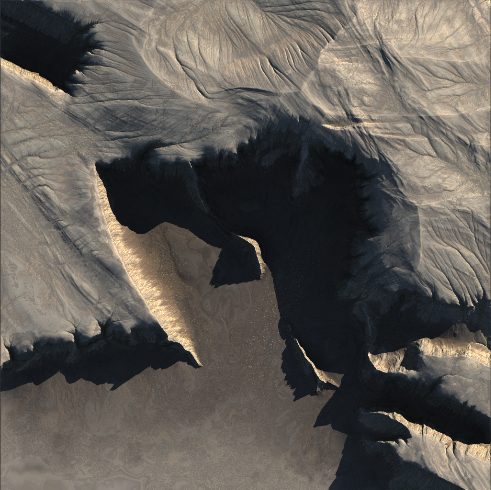
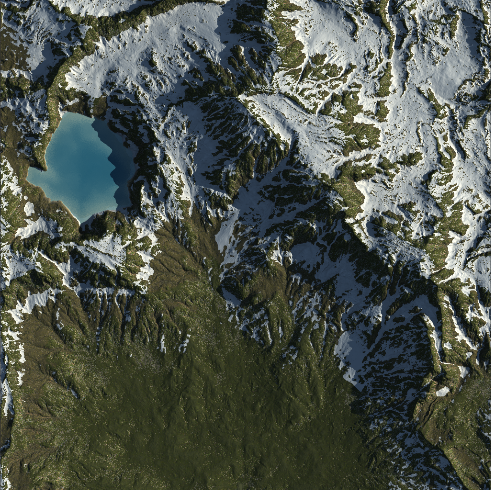
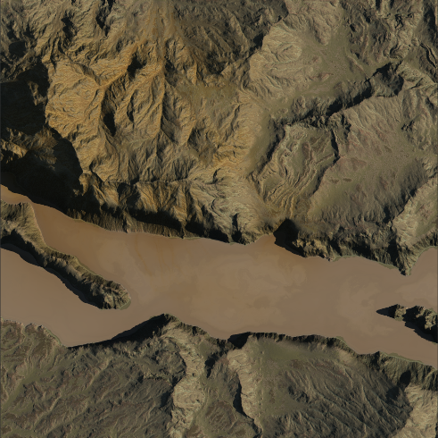
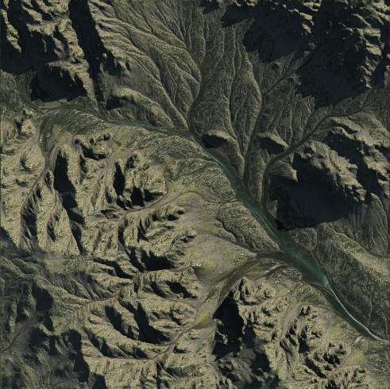

# Gaea-Projects
A collection of my Gaea Projects

The English part is **machine translation**

## 001

我不知道这是个什么，是我了解操作方式后随意做出的一个东西

I don't know what it is, but it's a random thing I made after I learned how to do it

## 002

**这并不是一个项目**，似乎我的版本中对于Worse Land节点有些bug，在保存后再次打开项目文件会出现错误，需要再次创建一个新的节点

**This is not a project**, and it seems that my version has a bug with the Worse Land node. Opening the project file again after saving will cause an error, requiring a new node to be created again

## 003

我非常喜欢这种雪山与绿色植物混合在一起的感觉，我对湖底的部分指定了一层沙滩的卫星图

I really liked the feeling of snow mountains mixed with greenery, and I assigned a satellite image of a layer of sand to the part of the bottom part of the lake

## 004

荒芜的地段，为了让整体有一种尘土覆盖的感觉，我在一个混合节点后又增加了一层尘土。我利用侵蚀节点的一些信息作为遮罩，产生了类似于矿物泄露的感觉，我觉得把它混合到水体部分是很棒的感觉

Barren area, in order to give the whole a feeling of dust covered, I added a layer of dust after a mixed node. I used some of the information from the erosion nodes as a mask to produce a feeling similar to mineral leakage, which I felt was a great feeling to mix into the water section

## 005

使用真实地形图修改来的一块区域，我觉得水体的部分非常棒

An area modified from a real topographic map. I think the water part is great

